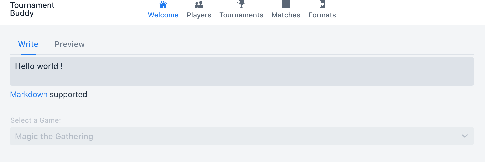
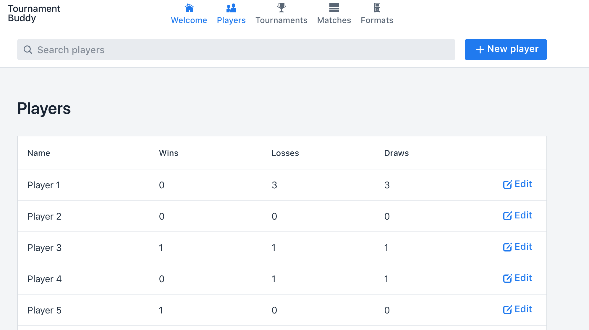
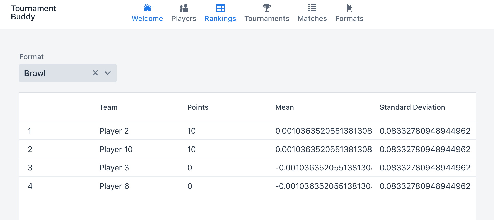
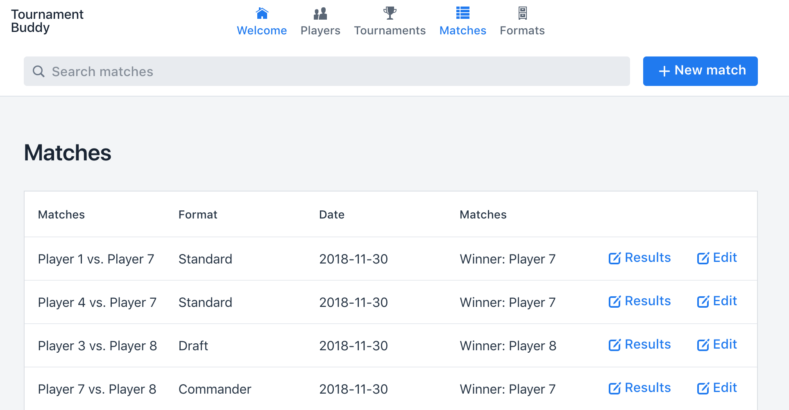
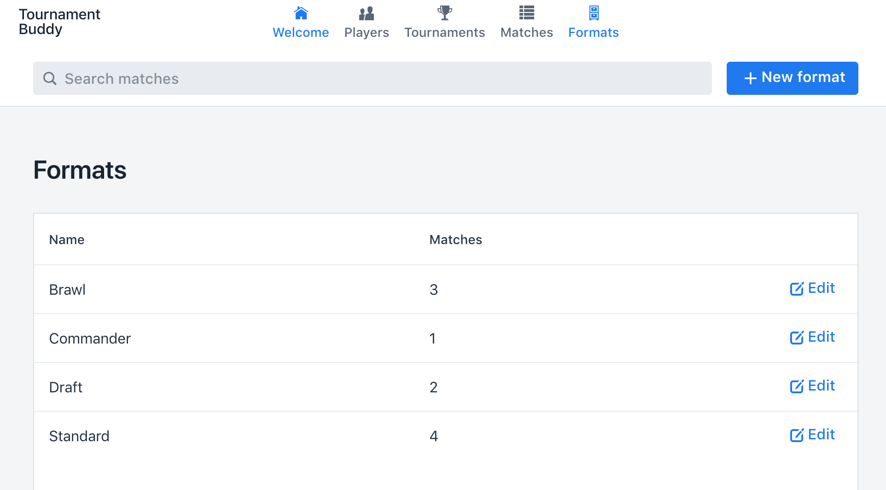

# Tournament Manager   

Tools to manage your tournament!

**Welcome**

Select a game and the rest of the appication refreshes it's content!

Available games:

* [Magic the Gathering](https://magic.wizards.com)

**Players**

Lists the players in the system as well as means to edit them and create new ones.

<!--**Tournaments**

Manage tournaments in different formats. Pairings and rounds are managed as well.-->

**Rankings**

Lists the player rankings in the system per game format.

**Matches**

List the matches recorded in the system.

**Formats**

Manage game formats.
